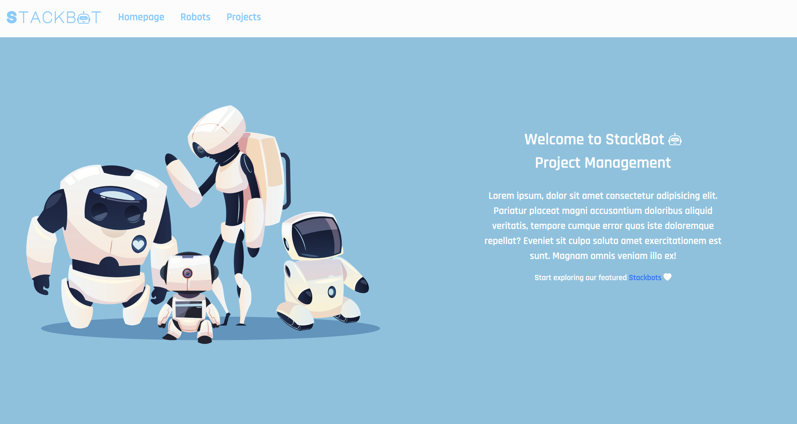

# 🤖 Stackbot

StackBot Inc., a business staffed entirely by robots. Each robot may be assigned to several projects at a time. This project is a full-stack single page application built with RESTful API routes that allows users to manage featured robots and projects.

## 🎥 Walkthrough Video

[Please check me out!](https://youtu.be/FGzaJNBscKs)

## 💻 Setup

1️⃣ Run `npm install` to install packages used in the project

2️⃣ Run `npm run start-dev` in the terminal to start the server, then navigate to [localhost:1337](http://localhost:1337) in the web browser.

3️⃣ Run the starting seed file in `seed.js` by executing `npm run seed`.

## 👩🏻‍💻 The Tools

This projects integrated:

* **Express** to implement RESTful API routes and handle HTTP requests
* **Sequelize** to interface with **PostgreSQL** database
* **React**, **Redux** and **React-Redux** on the front end to manage important state (i.e. robots and projects) in Redux store and display robot/project data
* **React-Router** to enable the navigation among views of various components 
* **React-Thunk** to perform side-effects (like AJAX requests)
* **Bootstrap** to create seemless and interactive user interface
